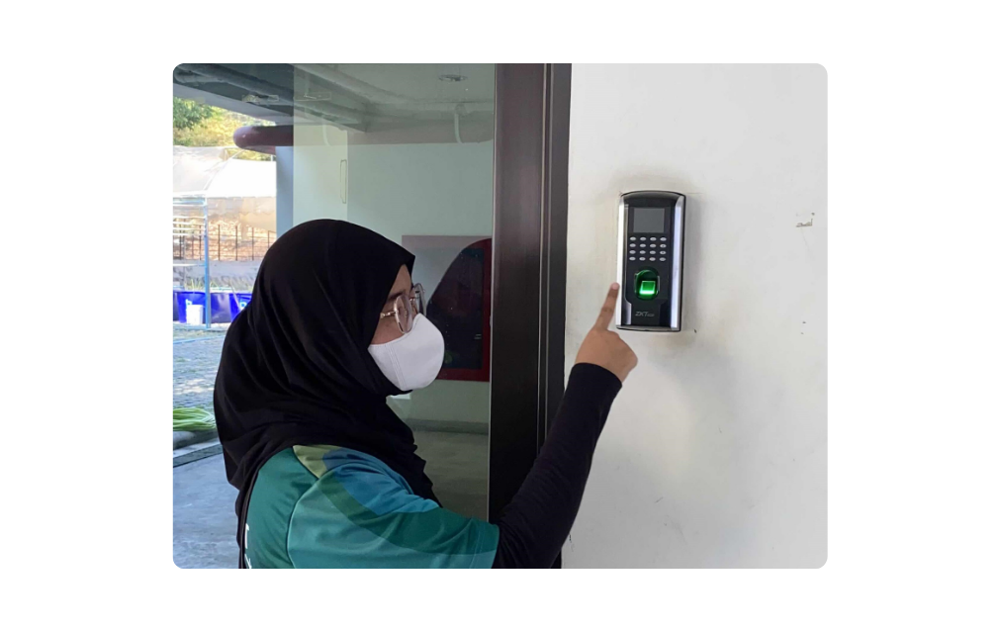

# Security Control 𖡎   
 

## ꒰ สแกนลายนิ้วมือเพื่อเข้าตึก ꒱

Type of Security Controls : Technical Control

Control Functions : Preventative 

Location : ตึก 26 ชั้น G (สแกนลายนิ้วมือเพื่อเข้าตึก)

- เครื่องสแกนลายนิ้วมือเป็น Technical Control ที่ใช้เทคโนโลยีช่วยป้องกัน (Preventative) การเข้าถึงที่ไม่ได้รับอนุญาต โดยการยืนยันตัวตนผ่านการตรวจสอบลายนิ้วมือ เพื่อควบคุมการเข้าถึง
   - ใช้ ลายนิ้วมือ ยืนยันตัวตนเพื่อให้แน่ใจว่าเฉพาะคนที่ได้รับอนุญาตเท่านั้นถึงจะเข้าได้

 ❰❰  [Back to profile](readme.md)
